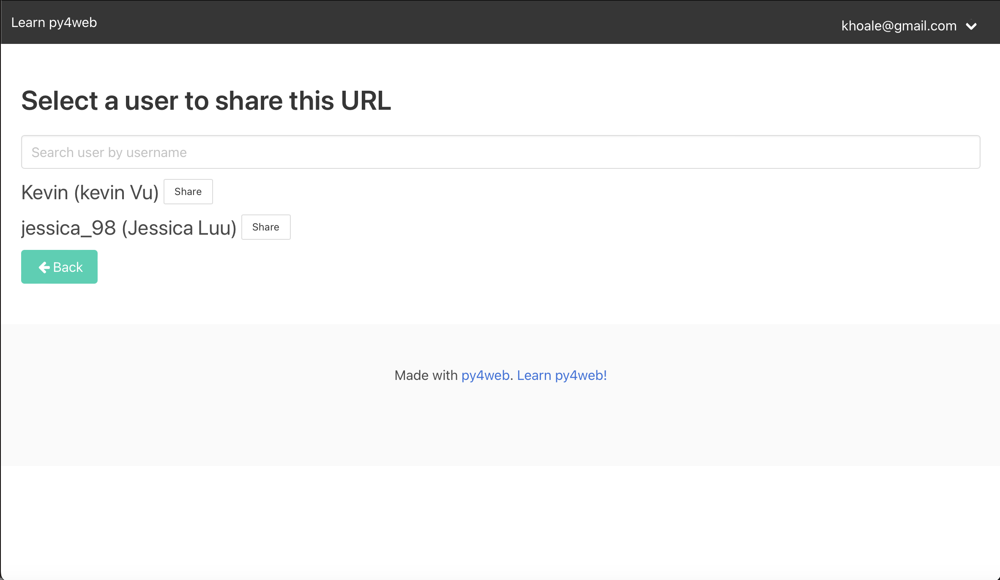

# URL Shortener Web App

## Home Page:

The "Shorten a URL" button navigates to a form in which the user can enter the original URL and URL's name. After submitting, the table on the home page contains a new entry like this:

By clicking on the shortened URL or pasting it into the browser, the user will be directed to the original website. The "Copy" button (at the end of each short URL) saves the URL to the clipboard.

The "Edit" option navigates to the edit page where the user can change the original URL and URL's name.
The "Delete" option removes the entry.
The "Share" option navigates to the share page.

## Share Page:

This page displays all users.
The search bar allows searching for users by username.
By clicking on the "Share" button next to a user, the selected URL will be sent to that user.

After sharing, the entry should look like this:

A URL can only be shared once with a user. So, after sharing, it will display "URL successfully shared."

## Receive Page:

This page displays all the URLs that have been shared with the user.
The user also has the option to re-share the URL with other users.
